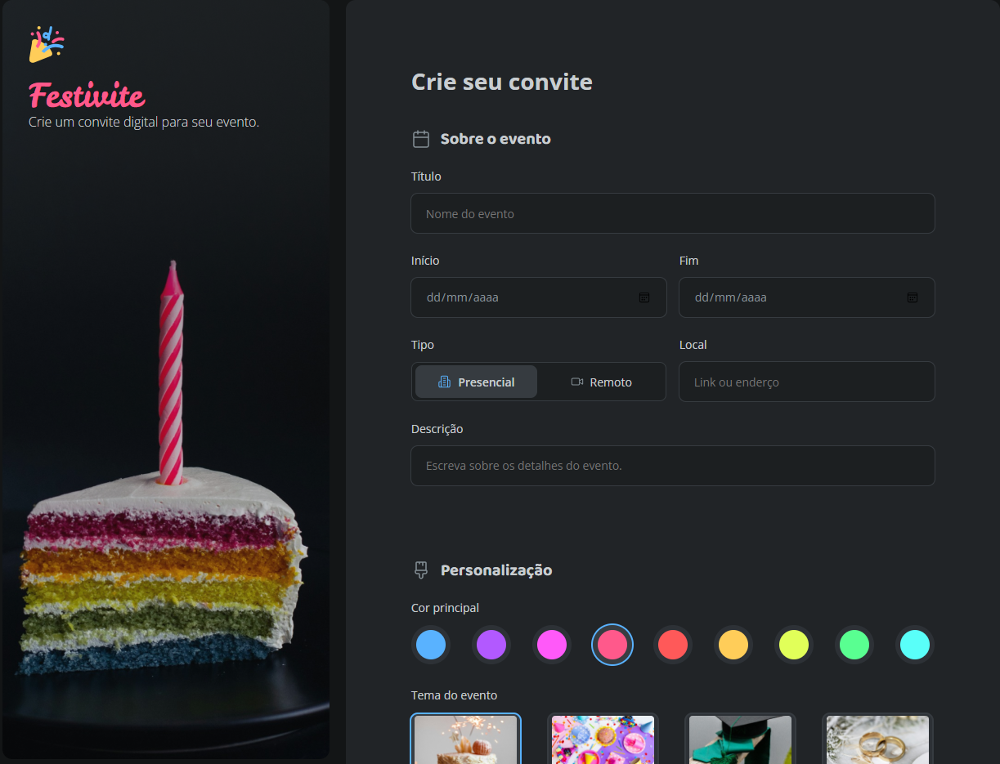

## 
Formulário de criação de convites personalizados

<b>TÓPICOS</b>

 

<a href="#-tecnologias">TECNOLOGIAS</a> | 
<a href="#️-ferramentas">FERRAMENTAS</a> |
<a href="#️-estrutura">ESTRUTURA</a> |
<a href="#-apresentação">APRESENTAÇÃO</a> | 
<a href="#-changelog">ATUALIZAÇÕES</a>

---

Projeto desenvolvido para explorar habilidades absorvidas durante o curso <b>Fullstack - Rocketseat</b>

<a href="https://ayrtonyamashita.github.io/formulario-de-convite/">Clique aqui</a> para visitar o site em tempo real.

## 🤖 TECNOLOGIAS

Neste momento do projeto foram utilizadas apenas as tecnologias de HTML e CSS puros sem uso de frameworks ou ferramentas auxiliares para execução.

## ⚒️ FERRAMENTAS

Para o inicio do escopo, apresentando a ideia inicial foi utilizando o <a href="https://www.figma.com/"> <b>Figma</b> </a> para realizar o desenho e layout do projeto, tirando do papel e adaptando ao digital.  
Com essa ferramenta foi possível apresentar a paleta de cores, fontes, tamanhos dentre outras opções presentes no projeto.
 
Iniciando na parte dos códigos, foi utilizado o <b><a href="https://vscode.dev/">VScode</a></b> devido a sua variedade de opções e aplicativos que auxiliam na proatividade do projeto.

## 🏗️ ESTRUTURA

O formulário de inscrição possui uma estrutura básica já que está no seu processo inicial de desenvolvimento, a parte que possui um pouco mais de cuidado em relação a estruturação é a organização de classes e estilos no CSS e a separação de assets do site.  

## 📺 APRESENTAÇÃO

 
O site possui campos padrões de cadastro como dados da criança, input de dados do tipo data, checkbox, radio, file, select dentre outras funções com intuito de extrair todas possibilidades que a tecnologia HTML fornece.

<a href="https://ayrtonyamashita.github.io/formulario-de-convite/">Clique aqui</a> para visitar o site em tempo real.

## 🔃 CHANGELOG

17/07/2024 - Site publicado parcialmente apenas HTML e CSS.
19/07/2024 - Adicionado README de apresentação do projeto.
